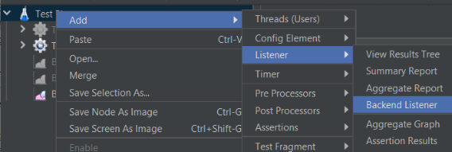
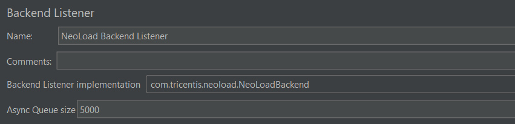
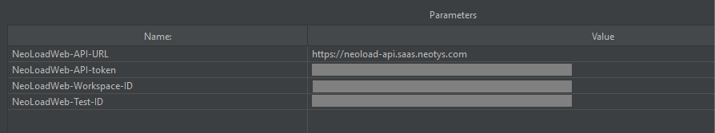
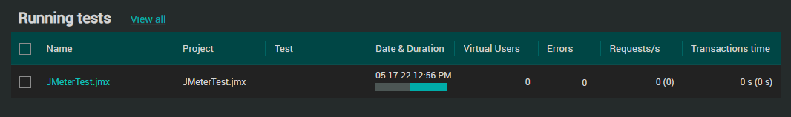
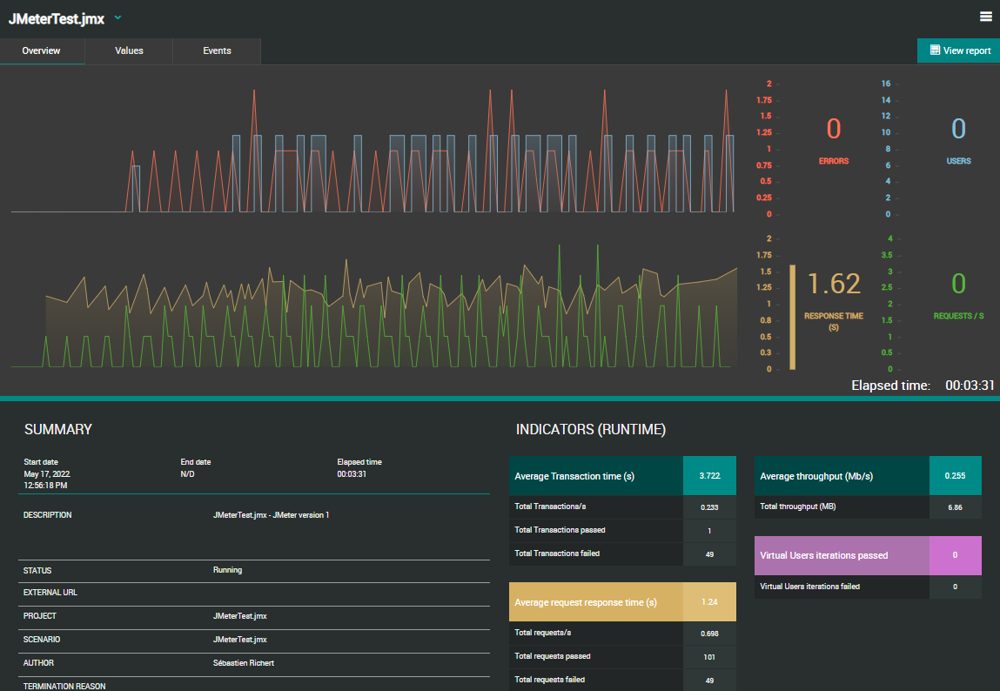
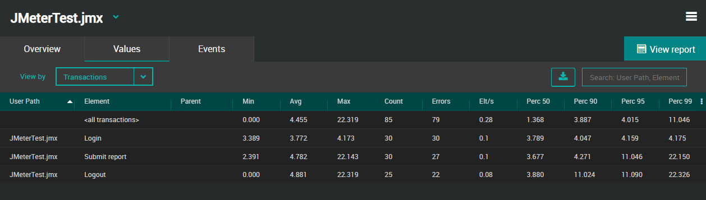
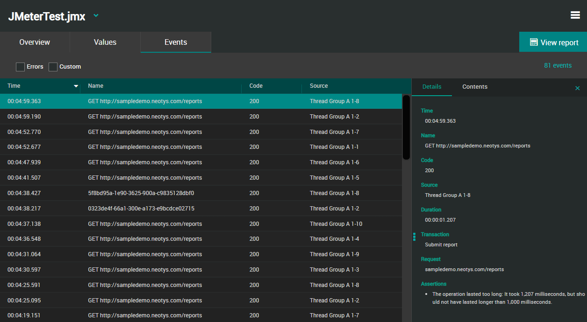
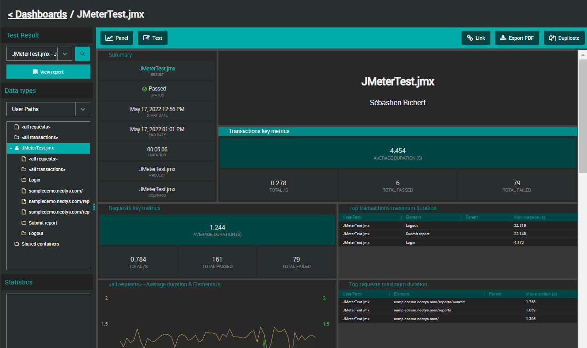
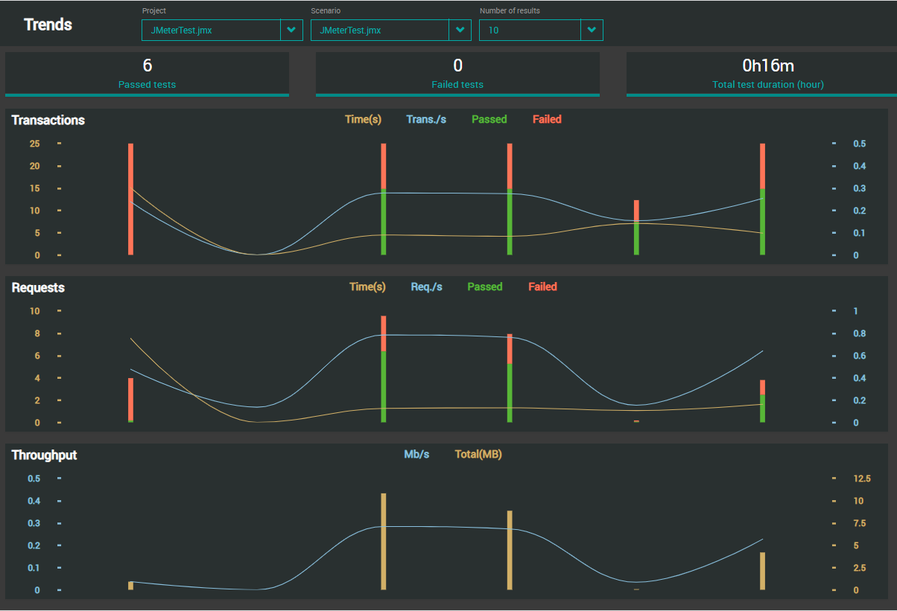

# Apache-JMeter
NeoLoad plugin for Apache JMeter

## Overview

This integration is a NeoLoad plugin to be installed in the [Apache JMeter](https://jmeter.apache.org/) environment. 
It allows sending live data from the JMeter test result execution to [Tricentis NeoLoad](https://www.tricentis.com/products/performance-testing-neoload/).

| Property | Value                                                                                  |
| ----------------    |----------------------------------------------------------------------------------------|
| Maturity | Experimental                                                                           |
| Author | Tricentis                                                                              |
| License           | [Apache License Version 2.0](LICENSE)                                                  |
| NeoLoad Web supported versions | SaaS platform, and onPremise from version 3.2                                          |
| Apache JMeter tested versions | Version 5.1, 5.2, 5.3, 5.4, 5.5, 5.6.2                                                 |
| Download releases | See the [latest release](https://github.com/Neotys-Labs/Apache-JMeter/releases/latest) |

## Installation

1. Download [latest release](https://github.com/Neotys-Labs/Apache-JMeter/releases/latest) of jar file ApacheJMeter_NeoLoad.
2. Put it in folder lib/ext of the JMeter installation directory.
3. Restart JMeter.

## Configuration

1. Open the JMeter project.
2. Add a BackendListener to the Test plan (right click on the test plan > Add > Listener > Backend Listener)

3. Set field "Backend Listener configuration" to "com.tricentis.neoload.NeoLoadBackend.

***WARNING: Do not define more than one NeoLoad Backend listener per JMeter project.***

### Parameters

The backend listener can be configured with the below parameters:

* NeoLoadWeb-API-URL: set the URL of the API endpoint for the NeoLoadWeb on premise deployment. 
* NeoLoadWeb-API-token: User API token to authenticate to NeoLoadWeb
* NeoLoadWeb-Workspace-ID: the ID of the workspace to send the results to.
* NeoLoadWeb-Test-ID: the ID of the test to send the results to.

## Usage

Once the JMeter test starts, a new test is create in NeoLoadWeb, as seen in the "Running Tests" section of the Home page:

## NeoLoad Web Analysis

### Test Result Overview

The Overview tab presents all basic details of the JMeter test.

More information in the [NeoLoad documentation](https://documentation.tricentis.com/neoload/nlweb/en/WebHelp/#27510.htm).

### Test Result Values
The Values tab allows sorting elements of a test quickly (Transactions and Requests).

More information in the [NeoLoad documentation](https://documentation.tricentis.com/neoload/nlweb/en/WebHelp/#24271.htm).

### Test Result Events

The Events tab displays all events occurred during the JMeter test.

More information in the [NeoLoad documentation](https://documentation.tricentis.com/neoload/nlweb/en/WebHelp/#24274.htm).

### Dashboards

The Dashboards view enables you to visualize in a very flexible layout how values evolve over JMeter test duration.

More information in the [NeoLoad documentation](https://documentation.tricentis.com/neoload/nlweb/en/WebHelp/#23448.htm).

### Trends

The Trends view makes it possible to visualize and analyze the results of a selected number of tests.

More information in the [NeoLoad documentation](https://documentation.tricentis.com/neoload/nlweb/en/WebHelp/#26401.htm).

## Troubleshooting

In case of issue, check for the JMeter logs. The location may vary depending on deployment, but typically they are located in the file jmeter.log in the bin folder of the JMeter installation directory.

## ChangeLog

* Version 1.0.9 (Dec 6th 2023): Retrieve JMeter version for data usage purpose
* Version 1.0.8 (Oct 16th 2023): Security updates
* Version 1.0.7 (Oct 13th 2023): Update Jmeter core libraries to version 5.6.2
* Version 1.0.6 (Nov 30th 2022): Support of NLWeb test Id
* Version 1.0.4 (Nov 16th 2022): Support of monitoring
* Version 1.0.3 (May 25th 2022): Support of NLWeb workspaces
* Version 1.0.2 (May 17th 2022): Initial release
