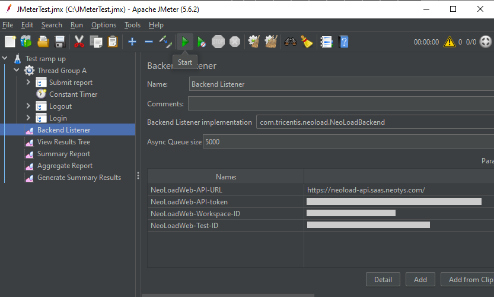
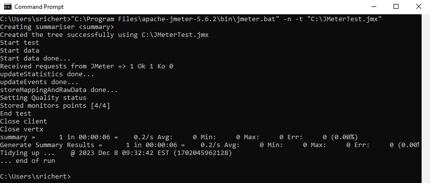
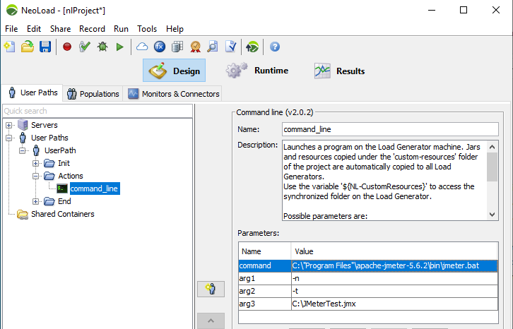

<p align="center"></p>

# Apache-JMeter

NeoLoad plugin for Apache JMeter

## Overview

This integration is a NeoLoad plugin to be installed in the [Apache JMeter](https://jmeter.apache.org/) environment.
It allows sending live data from the JMeter test result execution
to [Tricentis NeoLoad](https://www.tricentis.com/products/performance-testing-neoload/).

| Property                       | Value                                                                                  |
|--------------------------------|----------------------------------------------------------------------------------------|
| Maturity                       | Experimental                                                                           |
| Author                         | Tricentis                                                                              |
| License                        | [Apache License Version 2.0](LICENSE)                                                  |
| NeoLoad Web supported versions | SaaS platform, and onPremise from version 3.2                                          |
| Apache JMeter tested versions  | Version 5.1, 5.2, 5.3, 5.4, 5.5, 5.6.2                                                 |
| Download releases              | See the [latest release](https://github.com/Neotys-Labs/Apache-JMeter/releases/latest) |

## Installation

1. Download [latest release](https://github.com/Neotys-Labs/Apache-JMeter/releases/latest) of jar file
   ApacheJMeter_NeoLoad.
2. Put it in folder lib/ext of the JMeter installation directory.
3. Restart JMeter.

## Configuration

1. Open the JMeter project.
2. Add a BackendListener to the Test plan (right click on the test plan > Add > Listener > Backend Listener)
   

3. Set field "Backend Listener configuration" to "com.tricentis.neoload.NeoLoadBackend.
   

***WARNING: Do not define more than one NeoLoad Backend listener per JMeter project.***

### Parameters

The backend listener can be configured with the below parameters:


* NeoLoadWeb-API-URL: set the URL of the API endpoint for the NeoLoadWeb on premise deployment.
* NeoLoadWeb-API-token: User API token to authenticate to NeoLoadWeb
* NeoLoadWeb-Workspace-ID: the ID of the workspace to send the results to.
* NeoLoadWeb-Test-ID: the ID of the test to send the results to.

## Usage

The JMeter can be started from JMeter, or from NeoLoadGUI, or from NeoLoad Web.

### Starting test from JMeter

Once the backend listener is properly configured, the JMeter can be start manually from the JMeter UI:



or started in command line, specifying the JMeter launcher and the project path:

```
"C:\Program Files\apache-jmeter-5.6.2\bin\jmeter.bat" -n -t "C:\JMeterTest.jmx"
```



or started from any CI/CD pipeline.

### Starting test from NeoLoad GUI

The JMeter test execution can also be triggered from a NeoLoad test, thanks to the command line action.
Both JMeter and NeoLoad need to be installed on the same host.
Within the NeoLoad project, the JMeter test needed to be started only once, so it needs to be designed with a single
user path containing
and one command line action in the Actions container, and the scenario configured for a one virtual user and one
iteration:

* Have JMeter and NeoLoad installed on the same host
* Create new NeoLoad project
* Add a user path and a population with that user path
* Add a command line action in the Actions container of the user path. The action parameters need to be configured as
  below:
    * ``command``: the absolute path of the JMeter launcher,
      example ``C:\"Program Files"\apache-jmeter-5.6.2\bin\jmeter.bat``
    * ``arg1``: ``-n`` to specify the JMeter to run the test in a non-GUI (CLI) mode
    * ``arg2``: ``-t`` to specify the path to the JMeter test file
    * ``arg3``: the absolute path of the JMeter test file, for example ``C:\JMeterTest.jmx``
* Configure the scenario for 1 iteration, with constant load of 1 virtual user, using localhost load generator
* Save the project, and launch this scenario



### Starting test from NeoLoad Web

Following the procedure on launching the test from NeoLoad GUI, it is also possible to launch the test from NeoLoad Web.

* Open the NeoLoad project on NeoLoad GUI and configure the connectivity to NeoLoad Web according to
  the [NeoLoad documentation](https://documentation.tricentis.com/neoload/latest/en/content/reference_guide/neoload_web.htm).
* Export the NeoLoad project to NeoLoad Web
    * click on Menu 'File', then option 'Export project to NeoLoad Web...'
    * Select the workspace, enter a test name, check option 'Open the Test in browser after project upload'
    * Click 'Next', then 'Finish'
* Close NeoLoad
* Go to the NeoLoad Web on the browser, and open the newly uploaded test
* Copy the testId, as seen in the URL ``https://neoload.saas.neotys.com/#!test-settings/<testId>/overview``
* Open the JMeter, and edit the backend listener of the JMeter project to launch
* Add or edit value of parameter ``NeoLoadWeb-Test-ID`` with the testId copied on previous step
* Save JMeter project and close JMeter
* Start ControllerAgent and LoadGeneratorAgent on the same host as JMeter
* Configure ControllerAgent and LoadGeneratorAgent connectivity to NeoLoad Web, and verify they appear in the NeoLoad
  Web resource zone.
* On NeoLoad Web browser, open the Test previously uploaded and go to the configuration tab
* Select the static zone that contain the ControllerAgent and LoadGeneratorAgent started locally
* Start the test

***WARNING: Two concurrents test execution will be seen on NeoLoad Web for that test: one is the launcher NeoLoad and
the other one is the actual JMeter test execution.***

## NeoLoad Web Analysis

Once the JMeter test starts, a new test is create in NeoLoadWeb, as seen in the "Running Tests" section of the Home
page:


### Test Result Overview

The Overview tab presents all basic details of the JMeter test.


More information in
the [NeoLoad documentation](https://documentation.tricentis.com/neoload/nlweb/en/WebHelp/#27510.htm).

### Test Result Values

The Values tab allows sorting elements of a test quickly (Transactions and Requests).


More information in
the [NeoLoad documentation](https://documentation.tricentis.com/neoload/nlweb/en/WebHelp/#24271.htm).

### Test Result Events

The Events tab displays all events occurred during the JMeter test.


More information in
the [NeoLoad documentation](https://documentation.tricentis.com/neoload/nlweb/en/WebHelp/#24274.htm).

### Dashboards

The Dashboards view enables you to visualize in a very flexible layout how values evolve over JMeter test duration.


More information in
the [NeoLoad documentation](https://documentation.tricentis.com/neoload/nlweb/en/WebHelp/#23448.htm).

### Trends

The Trends view makes it possible to visualize and analyze the results of a selected number of tests.


More information in
the [NeoLoad documentation](https://documentation.tricentis.com/neoload/nlweb/en/WebHelp/#26401.htm).

## Troubleshooting

### Logging

In case of issue, check for the JMeter logs. The location may vary depending on deployment, but typically they are
located in the file jmeter.log in the bin folder of the JMeter installation directory.

### Remote debugging in IDE

To debug this backend listener from an IDE, edit launcher file jmeter.bat and add before the launching line:

```
set JVM_ARGS=-agentlib:jdwp=transport=dt_socket,server=y,suspend=n,address=*:5005
```

Then from the IDE create a Remote JVM debug launcher, attaching to host localhost and port 5005.

## ChangeLog

* Version 1.0.15 (Jul 9th 2024): Remove some log warnings
* Version 1.0.14 (May 2nd 2024): NlWeb stop support
* Version 1.0.13 (Apr 1st 2024): Send JMeter process stdout and stderr to NLWeb
* Version 1.0.12 (Mar 27th 2024): Support of launching from NLWeb
* Version 1.0.11 (Jan 23rd 2024): Support of multi thread groups
* Version 1.0.10 (Jan 17th 2024): Improve logging
* Version 1.0.9 (Dec 6th 2023): Retrieve JMeter version for data usage purpose
* Version 1.0.8 (Oct 16th 2023): Security updates
* Version 1.0.7 (Oct 13th 2023): Update Jmeter core libraries to version 5.6.2
* Version 1.0.6 (Nov 30th 2022): Support of NLWeb test Id
* Version 1.0.4 (Nov 16th 2022): Support of monitoring
* Version 1.0.3 (May 25th 2022): Support of NLWeb workspaces
* Version 1.0.2 (May 17th 2022): Initial release
